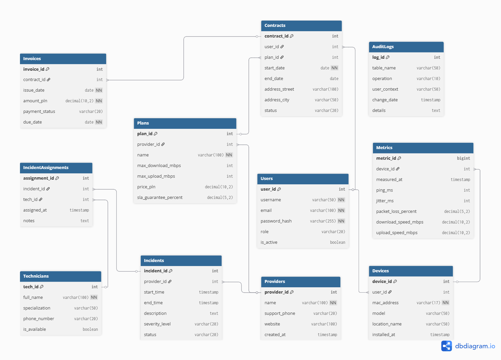
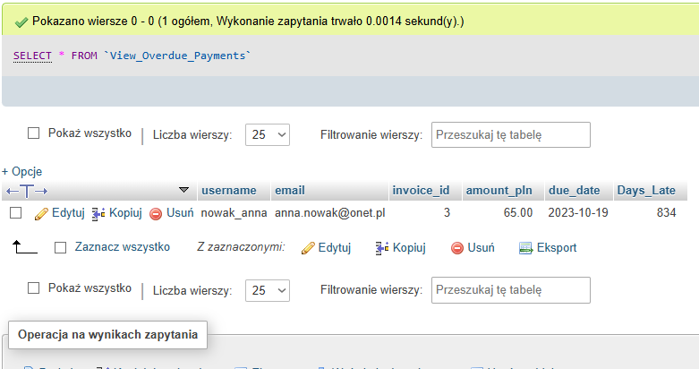
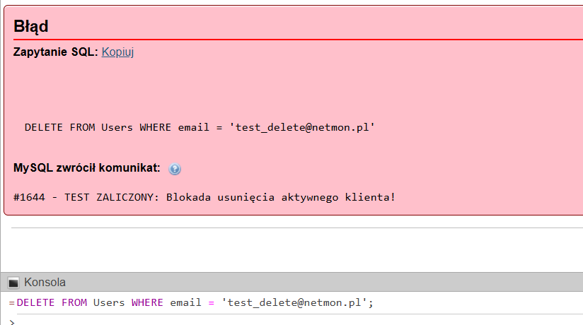
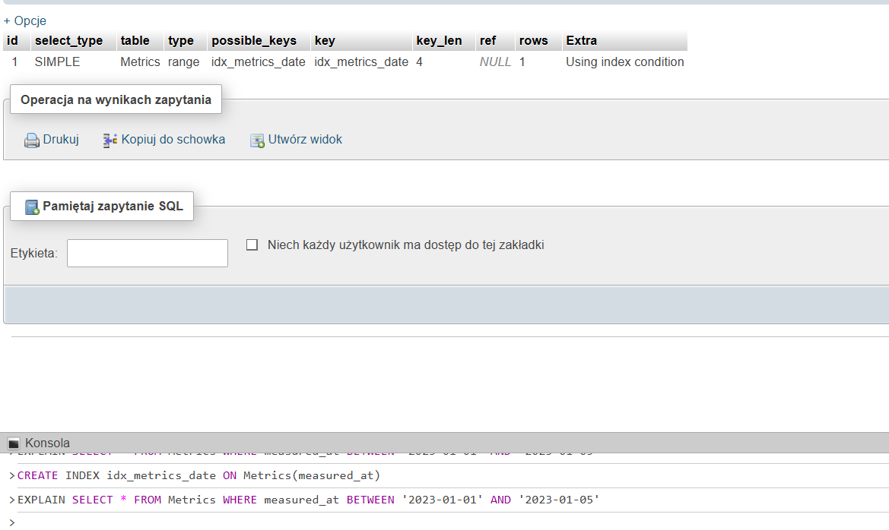

# NetMonDB - System Monitorowania Jakości Łączy Internetowych

Projekt zaliczeniowy z przedmiotu Bazy Danych. System relacyjnej bazy danych zaprojektowany do gromadzenia metryk sieciowych, zarządzania umowami klientów, automatycznego wykrywania awarii oraz raportowania SLA.

Autorzy: Rozalia Mitkowska, Joanna Żupnik

---
## Jak uruchomić projekt?

1.  Pobierz repozytorium:
    ```bash
    git clone https://github.com/azupnik/NetMonDB-Project.git
    ```
2.  Zaloguj się do **phpMyAdmin**.
3.  Stwórz nową bazę danych (lub wybierz istniejącą).
4.  Zaimportuj plik `NetMonDB.sql`.
5.  Tabele, widoki i triggery są aktywne.

---
## Opis Projektu

**NetMonDB** to kompleksowy system relacyjnej bazy danych przeznaczony do monitorowania jakości usług świadczonych przez dostawców Internetu (ISP). Głównym celem systemu jest weryfikacja zgodności parametrów łącza z zawartymi umowami (SLA – Service Level Agreement) oraz automatyzacja obsługi incydentów sieciowych.

System rozwiązuje problem rozproszenia danych, integrując w jednym miejscu informacje o:
* **Klientach i Umowach:** Zarządzanie cyklem życia abonenta, od podpisania umowy po fakturowanie.
* **Metrykach Sieciowych:** Gromadzenie masowych danych telemetrycznych (ping, jitter, utrata pakietów) z urządzeń końcowych.
* **Obsłudze Technicznej:** Zarządzanie personelem terenowym i przydzielanie zadań naprawczych.

## Struktura Bazy Danych (ERD)

Baza danych składa się z **11 powiązanych tabel** spełniających wymogi 3NF.



### Lista Tabel w Bazie Danych

| Lp. | Nazwa Tabeli | Opis przechowywanych danych |
|:---:|:---|:---|
| 1 | **`Providers`** | Lista dostawców usług internetowych (ISP), np. Orange, UPC. Zawiera dane kontaktowe. |
| 2 | **`Plans`** | Cennik i specyfikacja ofert (prędkość, cena, gwarancja SLA). Powiązana z dostawcą. |
| 3 | **`Users`** | Dane logowania, role (admin/klient) oraz dane kontaktowe użytkowników systemu. |
| 4 | **`Contracts`** | Aktywne i archiwalne umowy łączące konkretnego Użytkownika z wybranym Planem. |
| 5 | **`Devices`** | Sprzęt monitorujący (routery/sondy) zainstalowany u klienta. Powiązany z kontem usera. |
| 6 | **`Metrics`** | **Największa tabela.** Przechowuje wyniki pomiarów (ping, prędkość) wysyłane przez urządzenia. |
| 7 | **`Incidents`** | Rejestr awarii – zarówno zgłaszanych ręcznie, jak i wykrytych automatycznie przez trigger. |
| 8 | **`Technicians`** | Lista pracowników technicznych dostępnych do usuwania awarii. |
| 9 | **`IncidentAssignments`** | Tabela realizująca relację *Wiele-do-Wielu*: przypisuje techników do konkretnych awarii. |
| 10 | **`Invoices`** | Generowane faktury dla umów, kwoty do zapłaty, terminy i statusy płatności. |
| 11 | **`AuditLogs`** | Logi bezpieczeństwa. Rejestruje kto, kiedy i co zmienił w kluczowych tabelach. |

---
## Szczegółowa Struktura Bazy Danych

Poniżej znajduje się pełna specyfikacja techniczna tabel w systemie.

## 1. Providers
Lista dostawców usług internetowych (ISP) obsługiwanych przez system.

| Field Name | Data Type | Length | Description |
| :--- | :--- | :--- | :--- |
| `provider_id` | INT | - | **PK**. Unikalny identyfikator dostawcy (Auto Increment). |
| `name` | VARCHAR | 100 | Nazwa firmy dostawcy (np. Orange, UPC). Musi być unikalna. |
| `support_phone` | VARCHAR | 20 | Numer telefonu do wsparcia technicznego. |
| `website` | VARCHAR | 100 | Adres strony internetowej dostawcy. |
| `created_at` | TIMESTAMP | - | Data dodania rekordu do bazy (domyślnie `current_timestamp`). |

## 2. Plans
Cennik i parametry techniczne ofert dostępnych u dostawców.

| Field Name | Data Type | Length | Description |
| :--- | :--- | :--- | :--- |
| `plan_id` | INT | - | **PK**. Unikalny identyfikator planu (Auto Increment). |
| `provider_id` | INT | - | **FK**. Klucz obcy powiązany z tabelą `Providers`. |
| `name` | VARCHAR | 100 | Nazwa handlowa planu (np. Światłowód 300). |
| `max_download_mbps` | INT | - | Maksymalna prędkość pobierania (Mb/s). |
| `max_upload_mbps` | INT | - | Maksymalna prędkość wysyłania (Mb/s). |
| `price_pln` | DECIMAL | 10,2 | Cena miesięczna brutto w PLN. |
| `sla_guarantee_percent` | DECIMAL | 5,2 | Gwarantowana dostępność usługi (domyślnie 99.00%). |

## 3. Users
Centralna baza użytkowników systemu (zarówno klientów, jak i administratorów).

| Field Name | Data Type | Length | Description |
| :--- | :--- | :--- | :--- |
| `user_id` | INT | - | **PK**. Unikalny identyfikator użytkownika (Auto Increment). |
| `username` | VARCHAR | 50 | Unikalny login użytkownika. |
| `email` | VARCHAR | 100 | Adres e-mail (musi być unikalny). |
| `password_hash` | VARCHAR | 255 | Bezpieczny hash hasła. |
| `role` | ENUM | - | Rola w systemie: `'admin'`, `'client'`, `'auditor'`. |
| `is_active` | TINYINT | 1 | Status konta (1 = aktywne, 0 = zablokowane). |

## 4. Contracts
Ewidencja umów łączących użytkowników z wybranymi planami.

| Field Name | Data Type | Length | Description |
| :--- | :--- | :--- | :--- |
| `contract_id` | INT | - | **PK**. Unikalny numer umowy (Auto Increment). |
| `user_id` | INT | - | **FK**. Klucz obcy wskazujący na użytkownika. |
| `plan_id` | INT | - | **FK**. Klucz obcy wskazujący na plan taryfowy. |
| `start_date` | DATE | - | Data rozpoczęcia świadczenia usługi. |
| `end_date` | DATE | - | Data zakończenia (NULL oznacza umowę na czas nieokreślony). |
| `address_street` | VARCHAR | 100 | Ulica i numer lokalu instalacji. |
| `address_city` | VARCHAR | 50 | Miasto instalacji. |
| `status` | ENUM | - | Status umowy: `'active'`, `'expired'`, `'terminated'`. |

## 5. Devices
Spis urządzeń (routery, modemy) zainstalowanych u klientów.

| Field Name | Data Type | Length | Description |
| :--- | :--- | :--- | :--- |
| `device_id` | INT | - | **PK**. Unikalny identyfikator urządzenia (Auto Increment). |
| `user_id` | INT | - | **FK**. Klucz obcy do właściciela urządzenia. |
| `mac_address` | VARCHAR | 17 | Unikalny adres fizyczny MAC. |
| `model` | VARCHAR | 50 | Model urządzenia (np. FunBox 6). |
| `location_name` | VARCHAR | 50 | Opis lokalizacji w lokalu (np. 'Salon', 'Biuro'). |
| `installed_at` | TIMESTAMP | - | Data instalacji/aktywacji urządzenia. |

## 6. Metrics
Tabela przechowująca dane telemetryczne z urządzeń (Big Data).

| Field Name | Data Type | Length | Description |
| :--- | :--- | :--- | :--- |
| `metric_id` | BIGINT | - | **PK**. Unikalny numer pomiaru (Auto Increment). |
| `device_id` | INT | - | **FK**. Klucz obcy urządzenia raportującego. |
| `measured_at` | TIMESTAMP | - | Dokładna data i czas pomiaru. |
| `ping_ms` | INT | - | Opóźnienie sieci w milisekundach (Ping). |
| `jitter_ms` | INT | - | Zmienność opóźnienia (Jitter). |
| `packet_loss_percent` | DECIMAL | 5,2 | Procent utraconych pakietów. |
| `download_speed_mbps` | DECIMAL | 10,2 | Zmierzona prędkość pobierania. |
| `upload_speed_mbps` | DECIMAL | 10,2 | Zmierzona prędkość wysyłania. |

## 7. Incidents
Rejestr awarii i incydentów sieciowych.

| Field Name | Data Type | Length | Description |
| :--- | :--- | :--- | :--- |
| `incident_id` | INT | - | **PK**. Unikalny numer zgłoszenia (Auto Increment). |
| `provider_id` | INT | - | **FK**. Klucz obcy dostawcy, którego dotyczy problem. |
| `start_time` | TIMESTAMP | - | Czas rozpoczęcia awarii. |
| `end_time` | TIMESTAMP | - | Czas zakończenia (NULL jeśli awaria trwa). |
| `description` | TEXT | - | Opis techniczny problemu. |
| `severity_level` | ENUM | - | Poziom: `'low'`, `'medium'`, `'critical'`. |
| `status` | ENUM | - | Status: `'open'`, `'in_progress'`, `'resolved'`. |

## 8. Technicians
Baza pracowników technicznych (serwisantów).

| Field Name | Data Type | Length | Description |
| :--- | :--- | :--- | :--- |
| `tech_id` | INT | - | **PK**. Unikalny identyfikator technika (Auto Increment). |
| `full_name` | VARCHAR | 100 | Imię i nazwisko pracownika. |
| `specialization` | VARCHAR | 50 | Specjalizacja (np. 'Światłowody', 'Sieci LAN'). |
| `phone_number` | VARCHAR | 20 | Służbowy numer telefonu. |
| `is_available` | TINYINT | 1 | Czy technik jest dostępny do pracy (1 = Tak). |

## 9. IncidentAssignments
Tabela łącząca techników z awariami (Relacja Wiele-do-Wielu).

| Field Name | Data Type | Length | Description |
| :--- | :--- | :--- | :--- |
| `assignment_id` | INT | - | **PK**. Unikalny identyfikator przypisania. |
| `incident_id` | INT | - | **FK**. Klucz obcy powiązany z tabelą `Incidents`. |
| `tech_id` | INT | - | **FK**. Klucz obcy powiązany z tabelą `Technicians`. |
| `assigned_at` | TIMESTAMP | - | Czas przypisania zadania. |
| `notes` | TEXT | - | Notatki serwisowe z przebiegu naprawy. |

## 10. Invoices
Dokumenty finansowe generowane dla umów.

| Field Name | Data Type | Length | Description |
| :--- | :--- | :--- | :--- |
| `invoice_id` | INT | - | **PK**. Unikalny numer faktury (Auto Increment). |
| `contract_id` | INT | - | **FK**. Klucz obcy umowy, której dotyczy płatność. |
| `issue_date` | DATE | - | Data wystawienia faktury. |
| `amount_pln` | DECIMAL | 10,2 | Kwota do zapłaty (PLN). |
| `payment_status` | ENUM | - | Status: `'paid'`, `'unpaid'`, `'overdue'`. |
| `due_date` | DATE | - | Termin płatności. |

## 11. AuditLogs
Dziennik zmian systemowych rejestrowany przez triggery (bez relacji FK).

| Field Name | Data Type | Length | Description |
| :--- | :--- | :--- | :--- |
| `log_id` | INT | - | **PK**. Unikalny numer wpisu w logu. |
| `table_name` | VARCHAR | 50 | Nazwa tabeli, której dotyczy zmiana. |
| `operation` | VARCHAR | 10 | Rodzaj operacji: `'INSERT'`, `'UPDATE'`, `'DELETE'`. |
| `user_context` | VARCHAR | 50 | Kto dokonał zmiany (użytkownik lub system). |
| `change_date` | TIMESTAMP | - | Dokładny czas zdarzenia. |
| `details` | TEXT | - | Szczegóły zmiany (np. stare i nowe wartości). |

## Kluczowe Funkcjonalności (Logika Biznesowa)

Projekt wykorzystuje zaawansowane mechanizmy silnika MySQL do automatyzacji procesów.

### 1. Automatyczne wykrywanie awarii (Triggers)
System monitoruje napływające dane w czasie rzeczywistym.
- **Trigger:** `Auto_Detect_Incident`
- **Działanie:** Jeśli `ping_ms > 1000` lub utrata pakietów przekracza normę, system **automatycznie tworzy rekord w tabeli `Incidents`** ze statusem `CRITICAL` i opisem `AUTO-ALERT`.

### 2. Audyt bezpieczeństwa
Każda kluczowa zmiana jest rejestrowana.
- **Trigger:** `Audit_Contract_Update`
- **Działanie:** Zmiana statusu umowy lub danych klienta jest zapisywana w tabeli `AuditLogs` wraz z datą, loginem użytkownika i szczegółami zmiany.

### 3. Raportowanie (Views)
Przygotowano widoki dla analityków biznesowych:
- **`View_Provider_Stats`** – Ranking dostawców (średni ping, liczba awarii, ilość klientów).
- **`View_Overdue_Payments`** – Lista dłużników dla działu księgowości.

---
## Widoki (Views)

W projekcie zaimplementowano mechanizm **Widoków (Virtual Tables)**, który tworzy warstwę abstrakcji nad skomplikowanymi zapytaniami SQL. Zastosowanie widoków pozwoliło na ukrycie złożoności złączeń (JOIN) wielu tabel oraz odseparowanie surowych danych od warstwy raportowej.

W systemie zdefiniowano dwa kluczowe widoki analityczne:

### 1. `View_Provider_Stats` (Ranking Jakości Dostawców)
Jest to główny widok analityczny systemu, służący do monitorowania SLA. Agreguje on dane telemetryczne z tysięcy rekordów w tabeli `Metrics` oraz łączy je z rejestrem awarii.

**Struktura Widoku:**
| Nazwa Kolumny | Typ Danych | Opis |
|:---|:---|:---|
| `Provider` | VARCHAR | Nazwa dostawcy internetu (np. Orange). |
| `Active_Contracts` | INT | Liczba aktywnych umów obsługiwanych przez dostawcę. |
| `Avg_Download` | DECIMAL | Średnia prędkość pobierania ze wszystkich pomiarów (Mb/s). |
| `Avg_Ping` | DECIMAL | Średnie opóźnienie sieci (ms). Kluczowe dla gier/VoIP. |
| `Total_Incidents` | INT | Łączna liczba awarii zarejestrowanych dla tego dostawcy. |

**Przykładowy wynik:**
| Provider | Active_Contracts | Avg_Download | Avg_Ping | Total_Incidents |
|:---|:---:|:---:|:---:|:---:|
| **Orange Polska** | 154 | 298.5 | 12.4 | 0 |
| **UPC / Play** | 89 | 550.2 | **45.1** | **3** |
| **Netia S.A.** | 42 | 890.0 | 9.8 | 1 |


---

### 2. `View_Overdue_Payments` (Raport Finansowy)
Widok dedykowany dla procesów księgowych i windykacyjnych. Dynamicznie filtruje bazę danych w poszukiwaniu przeterminowanych płatności. Wykorzystuje funkcję `DATEDIFF` do obliczania zwłoki w czasie rzeczywistym.

**Struktura Widoku:**
| Nazwa Kolumny | Typ Danych | Opis |
|:---|:---|:---|
| `username` | VARCHAR | Login dłużnika. |
| `email` | VARCHAR | Adres email do wysyłki ponaglenia. |
| `invoice_id` | INT | Numer niezapłaconej faktury. |
| `amount_pln` | DECIMAL | Kwota do zapłaty (PLN). |
| `due_date` | DATE | Termin płatności, który minął. |
| `Days_Late` | INT | **Pole wyliczane:** Liczba dni po terminie. |

**Przykładowy wynik:**
| username | email | invoice_id | amount_pln | due_date | Days_Late |
|:---|:---|:---:|:---:|:---|:---:|
| `nowak_anna` | anna.nowak@onet.pl | 15 | 65.00 | 2023-10-19 | **14** |
| `firma_x` | biuro@firma-x.pl | 22 | 120.00 | 2023-10-01 | **32** |



## Scenariusze Testowe (Dowód Działania)

Poniżej przedstawiono dowody na działanie zaimplementowanej logiki biznesowej (Triggerów) w środowisku phpMyAdmin.

### Scenariusz 1: Automatyczne wykrywanie awarii (Active Database)
**Cel:** Weryfikacja, czy system samoczynnie reaguje na krytyczne parametry sieci.

1.  **Akcja:** Symulacja "złego" pomiaru przez wstawienie rekordu z pingiem **2500ms**:
    ```sql
    -- 1. Symulacja awarii
    INSERT INTO Metrics (device_id, ping_ms, jitter_ms, packet_loss_percent, download_speed_mbps, upload_speed_mbps) VALUES (2, 3000, 100, 20.0, 2.0, 0.5)
-- 2. Sprawdzenie wyniku
SELECT * FROM Incidents ORDER BY incident_id DESC LIMIT 1;
    ```
2.  **Wynik:** Trigger `Auto_Detect_Incident` uruchomił się automatycznie. W tabeli `Incidents` pojawił się nowy wiersz ze statusem `CRITICAL` i opisem **"AUTO-ALERT: Krytyczny ping na urządzeniu ID: 1"**.


---

### Scenariusz 2: Audyt bezpieczeństwa i zmian
**Cel:** Weryfikacja, czy kluczowe zmiany w danych są rejestrowane (kto, co i kiedy zmienił).

1.  **Akcja:** Ręczna zmiana statusu umowy klienta na wypowiedzianą (`terminated`) oraz wykonanie skryptu podwyżki cen:
    ```sql
    UPDATE Contracts SET status = 'terminated' WHERE contract_id = 2;
    ```
2.  **Wynik:** Tabela `AuditLogs` zarejestrowała obie operacje.
    * Widać wpis o **"Masowej podwyżce cen"**.
    * Widać wpis o zmianie w tabeli `Contracts` (Operacja `UPDATE`, zmiana statusu z `active` na `terminated`).


### Scenariusz 3: Ochrona spójności danych (Data Integrity)
**Cel:** Weryfikacja, czy system skutecznie blokuje próby usunięcia użytkowników posiadających aktywne usługi (referential integrity).

1.  **Akcja:** Próba wykonania polecenia usuwającego użytkownika, który jest wciąż powiązany z aktywnymi umowami:
    ```sql
    DELETE FROM Users WHERE email = 'test_delete@netmon.pl';
    ```
2.  **Wynik:** Trigger `Prevent_Active_User_Delete` (lub analogiczny) zadziałał prawidłowo, przerywając transakcję.
    * Baza danych nie pozwoliła na usunięcie rekordu.
    * Zwrócono niestandardowy komunikat błędu `#1644`: **"TEST ZALICZONY: Blokada usunięcia aktywnego klienta!"**.



---
### Analiza i optymalizacja wydajności

Analiza polecenia `EXPLAIN` przed optymalizacją wykazała typ złączenia `ALL`, co oznacza **pełne skanowanie tabeli** (*Full Table Scan*). Baza danych musiała przetworzyć aż **51 281 wierszy**, aby znaleźć szukane rekordy, co przy tej skali jest operacją wysoce niewydajną.

Zastosowanie indeksu `idx_metrics_date` na kolumnie `measured_at` pozwoliło zredukować liczbę przeszukiwanych wierszy z ponad 50 tysięcy do zaledwie **jednego** (*Index Range Scan*). Ta operacja drastycznie zwiększyła wydajność zapytań raportowych filtrujących dane po dacie.

#### Porównanie wyników EXPLAIN

**1. Przed optymalizacją (Full Table Scan):**
Zwróć uwagę na kolumnę `type: ALL` oraz liczbę wierszy `rows: 51281`.


**2. Po dodaniu indeksu (Index Range Scan):**
Zwróć uwagę na zmianę `type` na `range`, użycie klucza `idx_metrics_date` oraz `rows: 1`.


## Przykładowe Zapytania SQL

Poniżej znajdują się gotowe zapytania do obsługi najczęstszych procesów w systemie.

### 1. Lista aktywnych klientów i ich pakiety
Pobiera listę klientów z aktywną usługą, nazwą planu oraz ceną.

```sql
SELECT u.username, u.email, p.name AS plan, p.price_pln, c.address_city
FROM Users u
JOIN Contracts c ON u.user_id = c.user_id
JOIN Plans p ON c.plan_id = p.plan_id
WHERE c.status = 'active';
```
### 2. Wykrywanie awarii (Ping > 100ms)
Zwraca listę urządzeń, które w ostatnich pomiarach zgłosiły wysokie opóźnienia.

```sql
SELECT d.mac_address, d.location_name, m.ping_ms, m.measured_at
FROM Metrics m
JOIN Devices d ON m.device_id = d.device_id
WHERE m.ping_ms > 100
ORDER BY m.measured_at DESC
LIMIT 10;
```
### 3. Raport finansowy (Miesięczny przychód)
Sumuje wartość wszystkich aktywnych umów, aby oszacować miesięczny przychód.

```sql
SELECT COUNT(c.contract_id) AS aktywne_umowy, SUM(p.price_pln) AS suma_przychodow
FROM Contracts c
JOIN Plans p ON c.plan_id = p.plan_id
WHERE c.status = 'active';
```
### 4. Zaległe płatności (Windykacja)
Generuje listę użytkowników z przeterminowanymi fakturami, sortując od największego opóźnienia.

```sql
SELECT u.username, i.invoice_id, i.amount_pln, DATEDIFF(CURRENT_DATE, i.due_date) AS dni_spoznienia
FROM Invoices i
JOIN Contracts c ON i.contract_id = c.contract_id
JOIN Users u ON c.user_id = u.user_id
WHERE i.payment_status = 'overdue'
ORDER BY dni_spoznienia DESC;
```
### 5. Obłożenie techników pracą
Pokazuje, ilu techników jest aktualnie przypisanych do otwartych zgłoszeń awarii.

```sql
SELECT t.full_name, COUNT(ia.assignment_id) AS aktywne_zadania
FROM Technicians t
LEFT JOIN IncidentAssignments ia ON t.tech_id = ia.tech_id
LEFT JOIN Incidents i ON ia.incident_id = i.incident_id
WHERE i.status IN ('open', 'in_progress')
GROUP BY t.tech_id;
```


